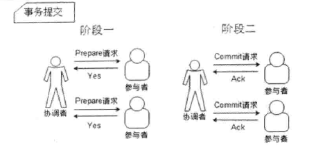
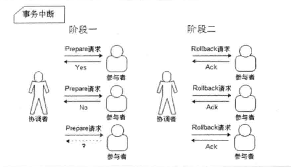

在分布式系统中，每个节点都能知道自己在进行的事务是成功还是失败，但确无法得知其它节点的处理结果。因此，当一个事务执行过程需要经过多个节点时，为了保证事务的ACID特性，就需要引入一个“协调者”的角色来进行统一调度，被调度的节点被称为“参与者”。协调者负责调度参与者的行为，并最终决定这些参与者是否要把某个事务进行提交或回滚。

<!-- more -->

通俗的描述就是为分布式节点找一个“领导”，节点的事务控制由这个“领导”来指挥。
基于这个思想，衍生出了二阶段提交和三阶段提交两种协议，本章主要讲解二阶段提交。

## 协议说明
> **二阶段提交**，简称2PC（Two-Phase Commit）。是计算机网络特别是数据库领域内，为了使基于分布式系统架构下的所有节点在进行事务处理过程中能够保证原子性和一致性而设计的一种算法。通常，二阶段提交协议也被认为是一种一致性协议，用来保证分布式系统数据的一致性。

顾名思义，二阶段提交协议就是将事务的提交过程分成了两个阶段，即提交事务请求和执行事务提交。

### 阶段一：提交事务请求
1. 事务询问

    协调者向所有的参与者发送事务内容，询问是否可以执行事务提交操作，然后等待各参与者的响应。
    
2. 执行事务

    参与者执行事务操作，将Undo和Redo信息记入到事务日志中。
    
3. 参与者响应

    如果参与者成功执行了事务，发送Yes响应；如果执行失败，发送No响应。
    
其实这个操作很类似于一次投票过程，因此二阶段提交协议的阶段一也可以称作“投票阶段”。

### 阶段二：执行事务提交
阶段二中，协调者会根据在阶段一中参与者的反馈来决定最终的事务提交或是回滚。
#### 事务提交
假如协调者接收到的都是Yes响应，那么就执行事务提交操作，提交过程分为几个步骤。

1. 发送事务提交请求

    协调者向所有参与者发出Commit请求。
    
2. 事务提交

    参与者接收到Commit请求后，会正式的提交事务，并在完成提交后释放整个事务执行期间的资源。

3. 反馈事务提交结果

    参与者完成事务提交后，向协调者响应Ack消息。
    
4. 完成事务

    协调者接收到所有Ack消息后，完成事务提交。
    
#### 事务回滚
假如任何一个参与者在第一阶段向协调者响应了No，或者协调者在等待超时后，都会发起事务的回滚操作。详细步骤与事务提交过程类似。

1. 发送回滚请求

    协调者向所有参与者发出Rollback请求。
2. 事务回滚

    参与者接收到Rollback请求后，利用阶段一中记录的Undo信息执行回滚操作，完成回滚操作后释放事务执行过程中占用的资源。
3. 反馈事务回滚结果

    参与者完成回滚操作后，向协调者发送Ack消息。
4. 中断事务

    协调者接收到所有Ack消息后，完成事务回滚。
    
***二阶段提交的核心思想就是对每一个事务都采用先尝试后提交的处理方式，因此也可以将二阶段提交看作是一个强一致性算法。***

结合下面的示意图理解起来会更容易一些。

*二阶段提交“事务提交”示意图：*

*二阶段提交“事务回滚”示意图：*

## 协议优缺点
通过前面的介绍相信大家已经发现二阶段提交协议**原理简单**，协议**实现方便**。但同时也存在一些缺点。

**对于协调者来讲，存在以下缺点：**

* 单点问题，协调者在整个协议中起到了非常重要的作用，一但协调者出现问题，那么整个流程将无法运行。特别的，如果协调者在阶段二中出现问题，那么参与者将一直处于事务资源锁定状态，而无法继续完成事务操作。

* 数据不一致，在阶段二中，如果协调者在发送Commit请求之后，发生了局部网络异常或者协调者在尚未发送完Commit请求之前发生崩溃，导致部分参与者接收到了Commit请求。于是，这部分接收到了Commit请求的参与者进行了事务提交，而其它未收到请求的参与者则无法进行提交，这样整个分布式系统就出现了数据不一致的现象。

**对于参与者来讲，存在以下缺点：**

* 同步阻塞，二阶段提交协议存在的最大也是最明显的一个问题。在二阶段提交的过程中，所有参与者都处于阻塞状态，也就是说，参与者在等待其它参与者响应的过程中，将无法进行其它任何操作。

* 容错机制较差，在协调者控制参与者进行事务提交询问过程中，参与者如果出现故障或协调者最终无法接收所有参与者的响应信息时，协调者只能根据自身的超时机制判断是否要回滚事务。简单来说就是任意一个节点的失败都会导致整个事务失败。
